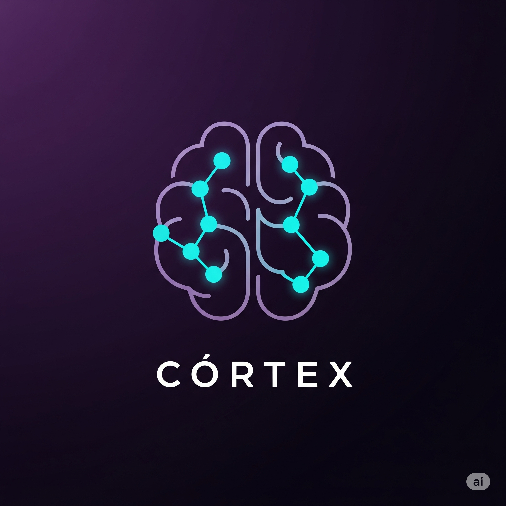

<div align="center">
  
</div>

# 🧠 Córtex

**Tu propio cerebro para orquestar múltiples modelos de IA al mínimo costo.**

Córtex es un gateway de inferencia y un balanceador de carga inteligente construido sobre **Elixir** y **Phoenix**. Su misión es permitir a los desarrolladores construir aplicaciones de IA robustas con un presupuesto cercano a cero, ofreciendo un modelo de doble licencia para dar soporte tanto a la comunidad open-source como a las necesidades comerciales.

---

## 🤔 ¿Por qué existe Córtex?

Las APIs de IA son increíbles, ¡pero pueden costar un ojo de la cara 💸! Córtex resuelve este problema creando un "cerebro" central que gestiona de forma inteligente tus recursos de IA, priorizando siempre las opciones gratuitas o locales. ¡Construye sin miedo a la factura!

---

## ✨ Características Principales

* **Arquitectura Multi-Provider 🌐:** Soporte nativo para **Ollama**, **Gemini**, **Cohere** y **Groq** con failover automático.
* **Worker Pool Inteligente 🏊:** Sistema de workers con health checks, priorización automática y tolerancia a fallos.
* **Rotación Inteligente de API Keys 🔑:** Manager avanzado con estrategias round-robin, least-used y random para maximizar el uso de APIs gratuitas.
* **Rate Limiting Automático ⏱️:** Detección y manejo automático de límites de API con bloqueo temporal y rotación.
* **Streaming Real 🌊:** Implementación completa de Server-Sent Events para respuestas en tiempo real de todos los providers.
* **Tolerancia a Fallos Nivel DIOS 💪:** Construido sobre Elixir/OTP con supervisión jerárquica y recuperación automática.
* **Failover en Cascada 🎯:** Si un provider falla, automáticamente usa el siguiente disponible según prioridad.
* **Arquitectura SOLID 🏗️:** Código limpio siguiendo principios de responsabilidad única y alta cohesión.

---

## 📮 ¿Cómo Funciona? ¡La Orquesta de IA!

Imagina que Córtex es una orquesta sinfónica donde cada músico es un proveedor de IA:

1.  **El Recepcionista (`Router`) 🧑‍💼:** Recibe tu petición (`POST /api/chat`) y la dirige al Director.
2.  **El Director (`Controller`) 🎭:** Prepara el concierto (streaming connection) y llama al Pool de Workers.
3.  **El Pool Manager (`Pool`) 🏊:** Evalúa qué workers están disponibles y selecciona el mejor según prioridad y salud.
4.  **Los Músicos (`Workers`) 🎵:** 
   - **Ollama Worker** (Prioridad 10): Tu orquesta local, siempre la primera opción 🏠
   - **Groq Worker** (Prioridad 20): El velocista ultrarrápido con LPUs ⚡
   - **Gemini Worker** (Prioridad 30): El equilibrado de Google 🧠
   - **Cohere Worker** (Prioridad 40): El especialista en conversaciones 💬
5.  **El API Key Manager** 🔑: Asegura que cada músico tenga sus "instrumentos" (API keys) listos y rota automáticamente cuando hay problemas.
6.  **La Respuesta** 🎼: El resultado llega como streaming en tiempo real, nota por nota.

### 🎯 **Failover Inteligente**
Si tu servidor Ollama está ocupado → automáticamente usa Groq  
Si Groq alcanza sus límites → rota a la siguiente API key o usa Gemini  
Si todo falla → Cohere al rescate  
**¡El show siempre continúa!** 🎪

---

## 🛠️ Instalación y Primeros Pasos

¡Manos a la obra! Para tener Córtex funcionando en tu máquina.

### 🐳 **Opción 1: Docker (Recomendado - Más Fácil)**

La forma más rápida de ejecutar Córtex es con Docker:

#### **Requisitos Previos**
* [Docker](https://docs.docker.com/get-docker/) instalado
* Git para clonar el proyecto

#### **Pasos**

1.  **Clona el Repositorio:**
    ```bash
    git clone https://github.com/tu-usuario/cortex.git
    cd cortex
    ```

2.  **Configura tus API Keys:**
    ```bash
    cp .env.example .env
    nano .env  # Edita y agrega tus API keys
    ```

3.  **¡Lanzamiento con Docker Compose! 🚀**
    ```bash
    docker-compose up -d
    ```

4.  **Verifica que esté funcionando:**
    ```bash
    curl http://localhost:4000/api/health
    ```

¡Listo! Tu gateway Córtex está corriendo en `http://localhost:4000`.

**Ver más detalles en [DOCKER.md](DOCKER.md)**

---

### 💻 **Opción 2: Instalación Local (Para Desarrollo)**

Si prefieres instalar localmente o desarrollar:

#### **Requisitos Previos**

Asegúrate de tener:
* [Elixir 1.15+](https://elixir-lang.org/install.html) instalado
* [Ollama](https://ollama.com/) instalado y funcionando (opcional)
* Git para clonar el proyecto

#### **Pasos**

1.  **Clona el Repositorio:**
    ```bash
    git clone https://github.com/tu-usuario/cortex.git
    cd cortex
    ```

2.  **Instalación Automática:**
    ```bash
    ./setup_cortex.sh
    ```
    
    O manualmente:
    ```bash
    mix deps.get
    cp .env.example .env
    nano .env  # Configura tus API keys
    ```

3.  **¡Lanzamiento! 🚀**
    ```bash
    # Opción 1: Script de inicio
    ./quick_start.sh
    
    # Opción 2: Comando directo
    mix phx.server
    
    # Opción 3: Con consola interactiva
    iex -S mix phx.server
    ```

¡Listo! Tu gateway Córtex está ahora escuchando en `http://localhost:4000`.

**Ver guía completa en [INSTALL.md](INSTALL.md)**

---

## ⚙️ Configuración Multi-Provider

Córtex ahora soporta múltiples proveedores de IA con configuración flexible:

### 🔧 **Variables de Entorno**

```bash
# API Keys para providers de IA
export GROQ_API_KEYS=your_groq_api_key_here
export GEMINI_API_KEYS=your_gemini_api_key_here  
export COHERE_API_KEYS=your_cohere_api_key_here

# Modelos a usar (opcional)
export GROQ_MODEL=llama-3.1-8b-instant
export GEMINI_MODEL=gemini-2.0-flash-001
export COHERE_MODEL=command-light

# Ollama local (opcional - backup ilimitado)
export OLLAMA_BASE_URL=http://localhost:11434
export OLLAMA_MODEL=gemma3:4b

# === GROQ (Ultra rápido) ===
GROQ_API_KEYS=gsk_key1,gsk_key2,gsk_key3
GROQ_MODEL=llama-3.1-8b-instant

# === GOOGLE GEMINI ===  
GEMINI_API_KEYS=AIza_key1,AIza_key2
GEMINI_MODEL=gemini-2.0-flash-001

# === COHERE ===
COHERE_API_KEYS=co_key1,co_key2
COHERE_MODEL=command

# === CONFIGURACIÓN AVANZADA ===
API_KEY_ROTATION_STRATEGY=round_robin  # round_robin, least_used, random
RATE_LIMIT_BLOCK_MINUTES=15           # Tiempo de bloqueo por rate limit
HEALTH_CHECK_INTERVAL=60              # Segundos entre health checks
```

### 🎯 **Estrategias de Rotación**

- **`round_robin`**: Rota API keys en orden secuencial
- **`least_used`**: Usa la key menos utilizada
- **`random`**: Selección aleatoria para distribución uniforme

### 🏥 **Health Checks Automáticos**

Cada worker verifica automáticamente:
- ✅ Conectividad con el API
- ✅ Rate limits disponibles  
- ✅ Latencia de respuesta
- ✅ Estado de las API keys

---

## 🎮 Modo de Uso

### 🚀 **Prueba Rápida**

Envía una petición con streaming en tiempo real:

```bash
curl -N -X POST http://localhost:4000/api/chat \
-H "Content-Type: application/json" \
-d '{
  "messages": [
    {
      "role": "user", 
      "content": "Explica la arquitectura de Córtex en 3 líneas"
    }
  ]
}'
```

### 🔥 **Ejemplo Avanzado con Parámetros**

```bash
curl -N -X POST http://localhost:4000/api/chat \
-H "Content-Type: application/json" \
-d '{
  "messages": [
    {
      "role": "system",
      "content": "Eres un experto en arquitectura de software"
    },
    {
      "role": "user", 
      "content": "¿Cómo funciona el failover en sistemas distribuidos?"
    }
  ],
  "temperature": 0.7,
  "max_tokens": 1000,
  "model": "groq"
}'
```

### 📊 **Monitoreo en Tiempo Real**

```bash
# Ver estado de workers
curl http://localhost:4000/api/health

# Ver estadísticas de API keys  
curl http://localhost:4000/api/stats

# Ver workers disponibles
curl http://localhost:4000/api/workers
```

### 🐳 **Comandos Docker Útiles**

```bash
# Ver logs en tiempo real
docker-compose logs -f

# Reiniciar Cortex
docker-compose restart

# Detener servicios
docker-compose down

# Actualizar imagen
docker-compose build && docker-compose up -d
```

**Deberías ver la respuesta escribiéndose palabra por palabra.** Si Ollama está ocupado, automáticamente switchea a Groq, Gemini o Cohere. ¡Magia multi-provider! ✨

-----

## 🗺️ Roadmap (Nuestros Próximos Hechizos)

### ✅ **Completado en v2.0**
- [x] 🌐 **Arquitectura Multi-Provider:** Soporte para Ollama, Groq, Gemini y Cohere
- [x] 🔑 **API Key Manager:** Rotación inteligente con estrategias múltiples  
- [x] 🏊 **Worker Pool:** Sistema robusto con health checks y failover
- [x] 🌊 **Streaming Real:** Server-Sent Events para todos los providers
- [x] ⚡ **Rate Limiting:** Detección automática y rotación de keys
- [x] 🧪 **Testing:** Cobertura completa con 73+ tests automatizados

### 🎯 **En Desarrollo**
- [ ] 🏗️ **Supervisor Updates:** Integración completa de nuevos workers  
- [ ] 📖 **Documentación:** Guías detalladas por proveedor
- [ ] ⚙️ **Config Manager:** Configuración dinámica desde .env

### 🔮 **Próximos Hechizos**
- [ ] 🧠 **Caché Inteligente:** ETS cache para respuestas instantáneas
- [ ] 📊 **Dashboard LiveView:** Panel de control en tiempo real 
- [ ] 🗺️ **Enrutamiento por Tarea:** AI que selecciona el mejor modelo automáticamente
- [ ] 🔌 **Más Providers:** OpenAI, Anthropic, Mistral, Azure OpenAI
- [ ] 🎛️ **Load Balancing:** Distribución inteligente de carga
- [ ] 📈 **Métricas Avanzadas:** Prometheus + Grafana integration

-----

## 🏗️ Arquitectura Técnica

### 🎭 **Componentes Principales**

```
┌─────────────────┐    ┌──────────────────┐    ┌─────────────────────┐
│   HTTP Client   │───▶│  Phoenix Router  │───▶│  Chat Controller    │
└─────────────────┘    └──────────────────┘    └─────────────────────┘
                                                           │
                                                           ▼
┌─────────────────────────────────────────────────────────────────────┐
│                         Worker Pool                                  │
│  ┌─────────────┐  ┌─────────────┐  ┌─────────────┐  ┌─────────────┐ │
│  │   Ollama    │  │    Groq     │  │   Gemini    │  │   Cohere    │ │
│  │  (Prio 10)  │  │  (Prio 20)  │  │  (Prio 30)  │  │  (Prio 40)  │ │
│  └─────────────┘  └─────────────┘  └─────────────┘  └─────────────┘ │
└─────────────────────────────────────────────────────────────────────┘
                                    │
                                    ▼
                        ┌─────────────────────┐
                        │  API Key Manager    │
                        │ ⚙️ Round Robin       │
                        │ 📊 Usage Stats       │
                        │ 🚫 Rate Limiting     │
                        └─────────────────────┘
```

### 🧬 **Principios SOLID Implementados**

- **Single Responsibility**: Cada worker maneja un solo proveedor
- **Open/Closed**: Fácil agregar nuevos providers sin modificar existentes  
- **Liskov Substitution**: Todos los workers implementan el mismo behaviour
- **Interface Segregation**: APIWorkerBase proporciona funcionalidad común
- **Dependency Inversion**: Pool depende de abstracciones, no implementaciones

### 🧪 **Testing & Calidad**

```bash
# Ejecutar todos los tests
mix test

# Solo tests de workers (sin integración)
mix test test/cortex/workers/adapters/ --exclude integration  

# Tests con coverage
mix test --cover

# Tests de integración con APIs reales (requiere API keys)
mix test --only integration

# Demos interactivos
mix run test_workers_demo.exs
mix run test_api_key_manager_demo.exs
```

**📊 Cobertura Actual**: 73+ tests automatizados cubriendo:
- ✅ Todos los workers (Ollama, Groq, Gemini, Cohere)
- ✅ API Key Manager con todas las estrategias 
- ✅ Transformación de mensajes por proveedor
- ✅ Extracción de chunks de streaming
- ✅ Health checks y error handling
- ✅ Rate limiting y failover

-----

## 🤝 ¿Quieres Ayudar? ¡Únete a la Magia\!

¡Las contribuciones son bienvenidas\! Si tienes una idea o quieres arreglar un bug:

1.  Abre un "Issue" para discutir tu idea.
2.  Haz un "Fork" del repositorio.
3.  Crea una nueva rama (`git checkout -b mi-nueva-feature`).
4.  Haz tus cambios y envía un "Pull Request".

-----

## 📜 Licencia

Córtex se distribuye bajo la licencia **GNU Affero General Public License v3.0 (AGPLv3)**. Esto significa que puedes usarlo, modificarlo y distribuirlo libremente. Si lo utilizas para potenciar un servicio accesible a través de una red, la licencia requiere que el código fuente completo de tu servicio también sea público.

Puedes leer la licencia completa [aquí](https://www.gnu.org/licenses/agpl-3.0.html).

-----

## 💼 Licencia Comercial

Si las condiciones de la licencia AGPLv3 no son compatibles con tu modelo de negocio (por ejemplo, si deseas ofrecer Córtex como un servicio de código cerrado), es posible adquirir una licencia comercial.

Para más detalles, por favor contacta a **Carlos Hinostroza** en **c@zea.cl**.