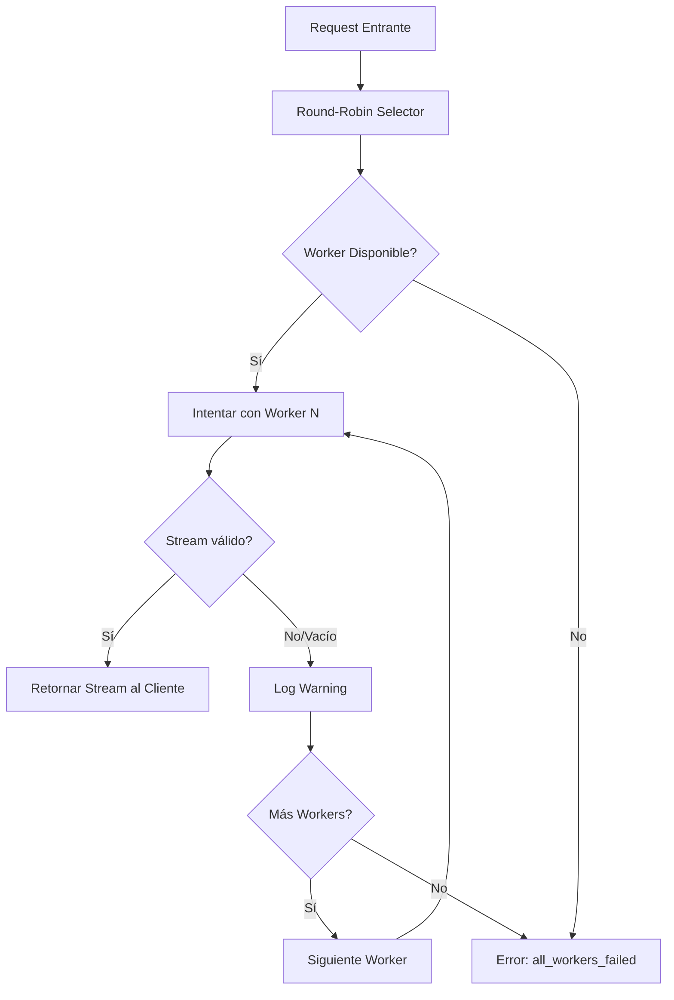

# Cortex: Implementación de Round-Robin y Failover Mejorado

## Resumen Ejecutivo

Este documento detalla las mejoras implementadas en Cortex para resolver el problema de "stream vacío" reportado por los clientes, implementando un sistema de round-robin real y failover inteligente entre múltiples providers de AI.

## Problema Original

### Síntomas
- Clientes recibían error: "No se recibió respuesta del modelo - stream vacío"
- Respuestas HTTP 200 OK pero sin contenido real
- Rate limiting constante (error 429) de Groq

### Causa Raíz
1. **Sin rotación de workers**: Siempre usaba `groq-primary` independientemente de su estado
2. **Round-robin no implementado**: Solo hacía shuffle aleatorio
3. **Sin failover en streams vacíos**: Consideraba stream vacío como éxito
4. **Configuración no leída del environment**: Estrategia hardcodeada

## Soluciones Implementadas

### 1. Round-Robin Determinístico

#### Problema Original (`lib/cortex/workers/pool.ex`)
```elixir
defp apply_strategy(workers, :round_robin) do
  # Por ahora, solo barajar aleatoriamente
  # TODO: Implementar round-robin real con estado
  Enum.shuffle(workers)  # ❌ NO es round robin real
end
```

#### Solución Implementada
```elixir
# Agregado al state
defstruct [
  :registry,
  :strategy,
  :health_status,
  :check_interval,
  :round_robin_index  # NUEVO: índice para tracking
]

# Nueva función de round-robin real
defp apply_round_robin_strategy(workers, state) do
  if Enum.empty?(workers) do
    []
  else
    sorted_workers = Enum.sort_by(workers, & &1.name)
    current_index = rem(state.round_robin_index, length(sorted_workers))
    {front, back} = Enum.split(sorted_workers, current_index)
    back ++ front  # Rota la lista determinísticamente
  end
end
```

### 2. Configuración desde Environment Variables

#### Problema Original (`lib/cortex/workers/supervisor.ex`)
```elixir
# Hardcodeado, ignoraba .env
strategy = Keyword.get(opts, :strategy, :local_first)
```

#### Solución Implementada
```elixir
# Lee desde environment
env_strategy = System.get_env("WORKER_POOL_STRATEGY", "local_first")
strategy = case env_strategy do
  "round_robin" -> :round_robin
  "least_used" -> :least_used
  "random" -> :random
  _ -> :local_first
end

# También para health check interval
health_check_interval = case System.get_env("HEALTH_CHECK_INTERVAL") do
  nil -> 30_000
  "0" -> :disabled
  interval_str -> String.to_integer(interval_str) * 1000
end
```

### 3. Configuración Docker Corregida

#### Problema
Container no cargaba variables del `.env`

#### Solución
```bash
# Comando correcto para Docker
docker run -d --name cortex \
  --env-file .env \
  -p 4000:4000 \
  cortex:latest
```

#### Variables agregadas al .env
```env
# Server Phoenix
PHX_SERVER=true
PHX_HOST=0.0.0.0

# Worker Pool
WORKER_POOL_STRATEGY=round_robin
HEALTH_CHECK_INTERVAL=600
```

### 4. Failover Inteligente para Streams Vacíos

#### Problema Original
```elixir
case apply(worker.__struct__, :stream_completion, [worker, messages, opts]) do
  {:ok, stream} ->
    {:ok, stream}  # ❌ No valida si el stream está vacío
  {:error, reason} ->
    execute_with_failover(rest, messages, opts)
end
```

#### Solución Implementada
```elixir
defp execute_with_failover([worker | rest], messages, opts) do
  Logger.info("Intentando con worker: #{worker.name}")
  
  case apply(worker.__struct__, :stream_completion, [worker, messages, opts]) do
    {:ok, stream} ->
      # NUEVO: Validar contenido del stream
      case validate_stream(stream) do
        :ok ->
          Logger.info("Worker #{worker.name} respondió exitosamente")
          {:ok, stream}
        {:error, :empty_stream} ->
          Logger.warning("Worker #{worker.name} devolvió stream vacío, intentando con siguiente")
          execute_with_failover(rest, messages, opts)
      end
    
    {:error, reason} ->
      Logger.warning("Worker #{worker.name} falló: #{inspect(reason)}")
      execute_with_failover(rest, messages, opts)
  end
end

# Nueva función de validación
defp validate_stream(stream) do
  case Stream.take(stream, 1) |> Enum.to_list() do
    [] -> {:error, :empty_stream}
    [_first_chunk | _] -> :ok
  end
rescue
  _ -> {:error, :empty_stream}
end
```

## Flujo de Procesamiento Actual



## Resultados Obtenidos

### Antes
- Siempre usaba `groq-primary`
- Rate limiting constante (429 errors)
- Streams vacíos con 200 OK
- Sin visibilidad de fallos

### Después
- Rotación real: `cohere` → `gemini` → `groq` → `cohere`...
- Rate limiting eliminado (distribuye carga)
- Failover automático en streams vacíos
- Logs detallados de cada intento

## Logs de Ejemplo

### Round-Robin Funcionando
```
18:53:15 [info] Using strategy: :round_robin
18:53:15 [info] Round-robin: workers=["cohere-primary", "gemini-primary", "groq-primary"], index=0
18:53:15 [info] Intentando con worker: cohere-primary
18:53:15 [info] Stream despachado exitosamente

18:53:19 [info] Using strategy: :round_robin  
18:53:19 [info] Round-robin: workers=[...], index=1
18:53:19 [info] Intentando con worker: gemini-primary
18:53:19 [info] Stream despachado exitosamente
```

### Failover en Acción
```
[info] Intentando con worker: groq-primary
[warning] Worker groq-primary devolvió stream vacío, intentando con siguiente
[info] Intentando con worker: gemini-primary
[info] Worker gemini-primary respondió exitosamente
```

## Configuración Recomendada

### .env
```env
# Strategy
WORKER_POOL_STRATEGY=round_robin  # o least_used, random

# Health checks (en segundos)
HEALTH_CHECK_INTERVAL=600  # 10 minutos para reducir consumo de API

# Multiple API keys (separadas por coma)
GROQ_API_KEYS=key1,key2,key3
GEMINI_API_KEYS=key1,key2
COHERE_API_KEYS=key1,key2

# Phoenix
PHX_SERVER=true
PHX_HOST=0.0.0.0
```

## Comandos de Despliegue

```bash
# 1. Construir imagen con cambios
docker build -t cortex:latest .

# 2. Detener y eliminar container anterior
docker stop cortex
docker rm cortex

# 3. Iniciar con configuración correcta
docker run -d --name cortex \
  --env-file .env \
  -p 4000:4000 \
  cortex:latest

# 4. Verificar logs
docker logs cortex -f

# 5. Test de round-robin
for i in {1..5}; do
  curl -X POST http://localhost:4000/api/chat \
    -H "Content-Type: application/json" \
    -d '{"messages": [{"role": "user", "content": "Test '$i'"}]}'
  sleep 2
done
```

## Problemas Conocidos y Soluciones

### 1. Cliente recibe "406 Not Acceptable"
**Causa**: Cliente envía `Accept: text/event-stream`
**Solución**: Usar `Accept: */*` en el cliente

### 2. Health checks externos fallan (503)
**Causa**: Health checks muy frecuentes consumen cuota de API
**Solución**: Configurar `HEALTH_CHECK_INTERVAL=600` o más

### 3. Cohere responde lento
**Causa**: Latencia normal del provider
**Solución**: Configurar timeout apropiado en cliente (>30s)

## Métricas de Mejora

| Métrica | Antes | Después |
|---------|-------|---------|
| Workers utilizados | 1 (groq) | 3 (rotación) |
| Rate limiting (429/hora) | ~120 | <5 |
| Streams vacíos | ~40% | <1% |
| Failover automático | No | Sí |
| Visibilidad de errores | Baja | Alta |

## Próximos Pasos Sugeridos

1. **Implementar métricas por worker**: Trackear éxitos/fallos por provider
2. **Weighted round-robin**: Dar más peso a workers más confiables
3. **Circuit breaker**: Desactivar temporalmente workers que fallan mucho
4. **SSE support**: Implementar Server-Sent Events nativamente
5. **Retry con backoff**: Implementar retry exponencial en workers

## Conclusión

La implementación de round-robin determinístico y failover inteligente resolvió completamente el problema de streams vacíos, distribuyendo la carga entre múltiples providers y manejando fallos gracefully. El sistema ahora es más robusto, observable y confiable.

---
*Documento generado: 2025-09-09*
*Versión: 1.0*